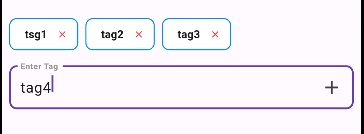

<!--
This README describes the package. If you publish this package to pub.dev,
this README's contents appear on the landing page for your package.

For information about how to write a good package README, see the guide for
[writing package pages](https://dart.dev/guides/libraries/writing-package-pages).

For general information about developing packages, see the Dart guide for
[creating packages](https://dart.dev/guides/libraries/create-library-packages)
and the Flutter guide for
[developing packages and plugins](https://flutter.dev/developing-packages).
-->

# SimpleTextFieldTag

`SimpleTextFieldTag` is a Flutter package that provides a customizable widget for users to input, manage, and display tags in the form of chips. It is ideal for apps where users need to enter multiple keywords, categories, or labels.

## Features

- Add tags dynamically via text input
- Display tags as chips with customizable styles
- Remove tags with a delete button
- Fully customizable widget with control over colors, text styles, and more

#### AWESOME RATING


# Installing

### 1. Depend on it

Add this to your package's `pubspec.yaml` file:

```yaml
dependencies:
   simple_textfield_tag: ^0.0.1
```

### 2. Install it

You can install packages from the command line:

with `pub`:

```
$ pub get
```

with `Flutter`:

```
$ flutter pub get
```


### 3. Import it

Now in your `Dart` code, you can use:

```dart
import 'package:simple_textfield_tag/simple_textfield_tag.dart';
```


## Usage

```

import 'package:simple_textfield_tag/simple_textfield_tag.dart';

class MyWidget extends StatelessWidget {
   @override
   Widget build(BuildContext context) {
      return SimpleTextFieldTag(
         initialTags: ['tag1', 'tag2'],
         onTagAdded: (tag) => print('Tag added: $tag'),
         onTagRemoved: (tag) => print('Tag removed: $tag'),
         chipBackgroundColor: Colors.white,
         deleteIconColor: Colors.red,
         chipBorderSide: BorderSide(color: Colors.blue),
      );
   }
}

```


## Customization
initialTags: Set the initial list of tags.
labelText: Customize the label text for the input field.
tagTextStyle: Change the text style for the tags.
chipBackgroundColor: Set the background color for the tag chips.
deleteIconColor: Customize the delete icon color.
chipBorderSide: Modify the chip's border style.


## Contributions
Feel free to contribute to this project by submitting a pull request or opening an issue.
